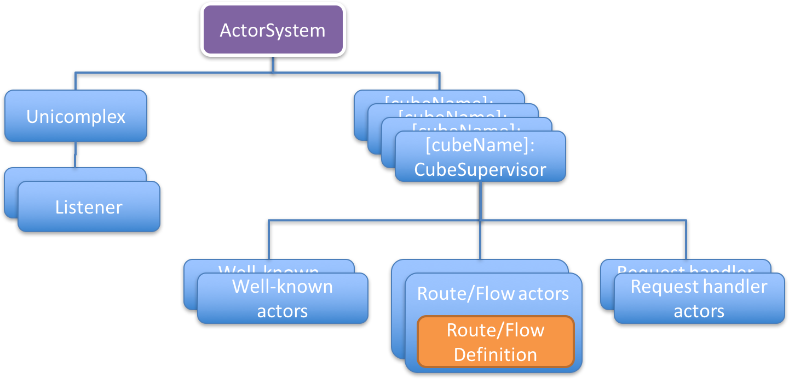

# Unicomplex Actor 层次结构

squbs设置上面图片中显示的actor和组件层次结构, 以支持一个模块化运行时, 用于actor和服务在一个squbs系统中运行。

* **ActorSystem** - 这是akka ActorSystem。 一个squbs系统使用一个单独的actor system来支持所有的服务和cube。这将确保我们为运行在squbs系统中的调度器提供一个单一的控制点。这个ActorSystem默认名称为"squbs"，但是可以通过重写application.conf中的设置来修改。

* **Unicomplex** - 这是核心的单例actor，用来管理squbs系统。它注册所有的cube和web服务actor间的通信，以及cube监管者(用于管理系统生命周期)。它也负责启动web服务和服务注册actor。应用或者系统组件能够通过调用`Unicomplex()`访问`Unicomplex`的`ActorRef`。

* **Listeners** - 监听器创建`Flow`, 其用于处理传入HTTP请求, 并将它们绑定到配置的端口。它们携带在`reference.conf`或`application.conf`中配置的监听器名称。默认情况下，默认监听器地址0.0.0.0(任意接口)上绑定端口8080，不使用https。然而，可以在`application.conf`中覆盖。额外的监听器可以分别在库或应用的`reference.conf`或`application.conf`中配置。

* **RouteDefinition/FlowDefinition** - `RouteDefinition`和`FlowDefinition`都是不同形式的服务定义。一个`RouteDefinition`为服务定义了`Route`, 而一个`FlowDefinition`定义了一个`Flow`。这两个是不同类型的请求处理器，处理传入的Http请求。`RouteDefinition`和`FlowDefinition`本身都不是actor, 而是一个继承了各自的特质的类。它们由各自的服务注册, 并由相应的actor招待。

* **Route/Flow actors** - `org.squbs.unicomplex.RouteActor`或`org.squbs.unicomplex.FlowActor`类型的actor，由`CubeSupervisor`创建，用于招待每个相应的`RouteDefinition`或`FlowDefinition`。因此, 他们成为子actor，并被它们所属的`CubeSupervisor`监管。它们的请求处理程序被自动注册到它们绑定的所有监听器上，从而允许将来自监听器的请求派发到相应的请求处理程序。

* **Request handler actors** - 与其在服务中使用`RouteDefinition`/`FlowDefinition`, 开发人员不如选择在低级别API上工作并为此注册一个请求处理actor。避开高级路由API 通常会占用较少的内存, 并允许处理流式请求, 但与路由DSL相比更难进行编码。

* **CubeSupervisors** - `CubeSupervisors`直接由actor系统创建并使用`Unicomplex`注册自己。每个cube创建一个CubeSupervisor实例。它们充当服务处理器的监管者，并注册(well-known) actor (可以通过名称查找)，并处理错误，和重启这些actor。它负责子actor的生命周期。Well-known actor需要初始化，将在`squbs-meta.conf`文件中定义此类需求。它们可以与父辈通信 - CubeSupervisor管理它们的初始化状态。CubeSupervisor将再次传达生命周期状态和初始化变更给`Unicomplex`, 其维护整个系统的生命周期状态。请参考[Bootstraping](bootstrap.md)了解在`squbs-meta.conf`中cube和服务配置项的信息。也可以参考[运行时生命周期&API](lifecycle.md)了解生命周期状态和生命周期状态变更的信息。 此外, cube结构还为well-known actor提供了命名空间, 以防止由不同cube提供的well-known actor之间的命名冲突。
`RouteActor`和`FlowActor`在技术上等同于wellk-nown actor。

* **Well-known actors** - 这些actor都是注册过的actor，其由CubeSupervisor启动。它们通过`squbs-meta`.conf注册和提供基本的启动信息，比如路由。请参考[Bootstrapping](bootstrap.md)中关于cube配置的详细信息。你可以通过cube的`reference.conf`添加额外的配置。请参考[Typesafe配置](https://github.com/typesafehub/config)库文档中关于`reference.conf`和`application.conf`的详细信息。
